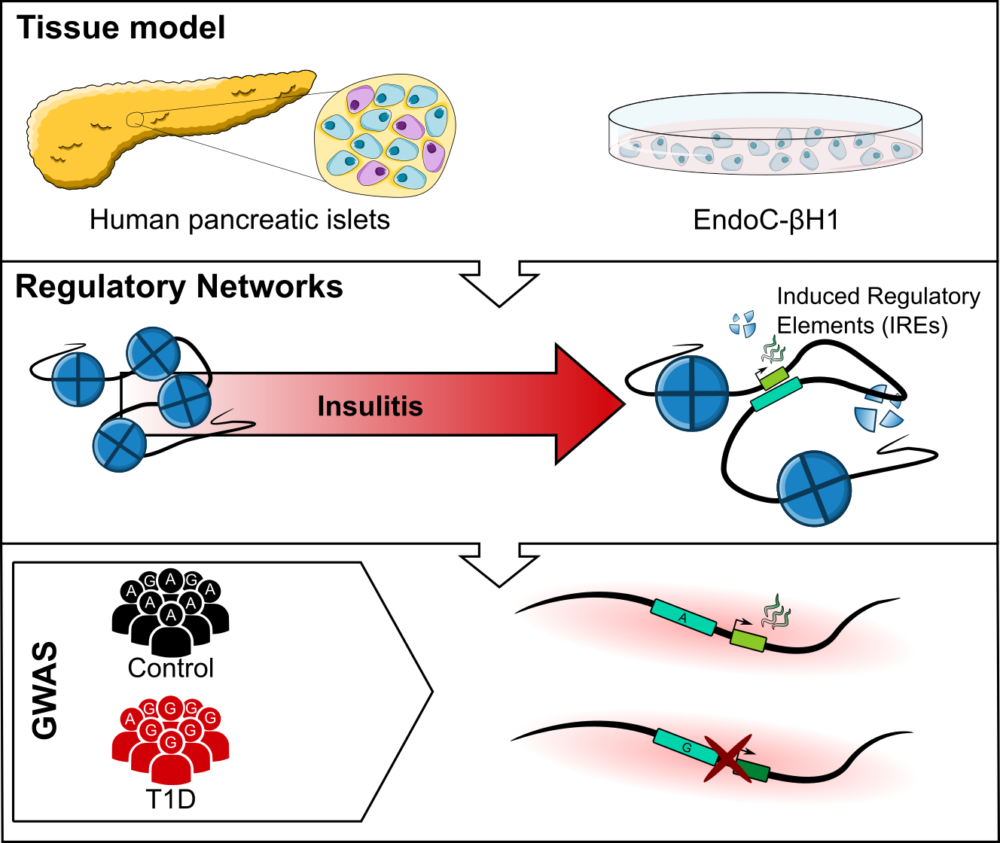

## Publication

> **Ramos-Rodríguez, M.**, Raurell-Vila, H., Colli, M.L. et al. The impact of proinflammatory cytokines on the β-cell regulatory landscape provides insights into the genetics of type 1 diabetes. *Nat Genet.* **51**, 1588–1595 (2019) doi:10.1038/s41588-019-0524-6

```{r, echo=FALSE, out.width='60%'}

```


## Data availability

The different datasets that were used in the publication can be downloaded from GEO with the following accessions: 


```{r echo=FALSE}
ids <- read.delim("../data/geo_ids_cyt.tsv")
knitr::kable(ids,
             col.names=c("GEO ID", "Experiment", "Link"))
```


## Data processing

### ATAC-seq and H3K27ac CHIP-seq

### RNA-seq

### UMI-4C


