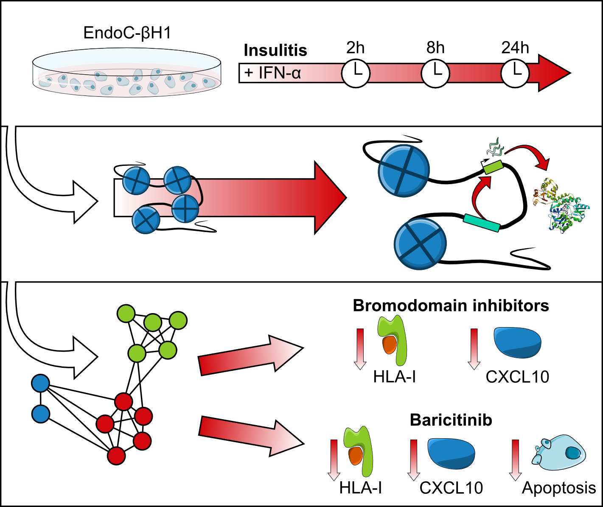

## Publication

> Colli, M.L., **Ramos-Rodríguez, M.**, Nakayasu, N.S. et al. An integrated multi-omics approach identifies the landscape of interferon-$\alpha$-mediated responses of human pancreatic $\beta$ cells. *Nat Commun.* (2020)

```{r, echo=FALSE, out.width='60%'}

```

## Data availability

The different datasets that were used in the publication can be downloaded from GEO with the following accessions: 


```{r echo=FALSE}
ids <- read.delim("../data/geo_ids_ifna.tsv")
knitr::kable(ids,
             col.names=c("GEO ID", "Experiment", "Link"))
```

## Data processing


## Index of Results
